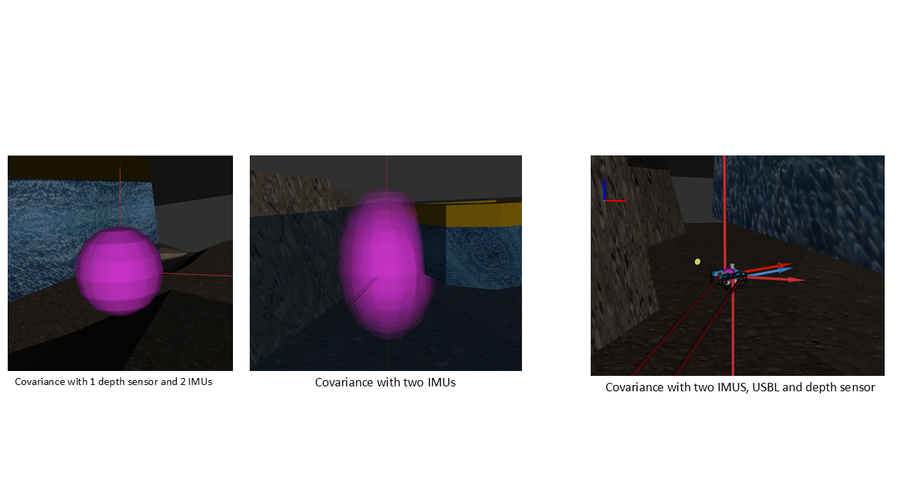

# ecn_drones
Labs from the drone course of École Centrale de Nantes Masters in Advanced robotics

## LAB 1 - Waypoint following and Sensor Fusion
From a ROS2 node that hands over a list of waypoints to be tracked, the completion of this task consists in implementing a control law for the robot to drive itself to each waypoint. Once the AUV reaches a pose, within a threshold of a given waypoint (both in position and yaw), it directs itself to the next one on the list.
Similarly, we explore different sensor fusion combinations with an extended kalmann filter in the robot localization package, and their impact in the localization accuracy. 

